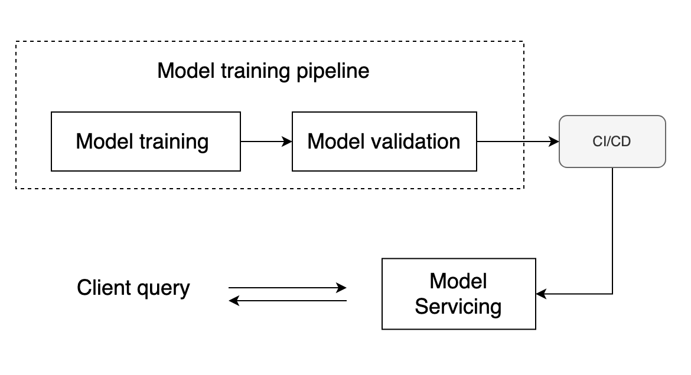

# ML - Engineering challenge

## Objective

This system aims to predict the progress of diabetes in one year using bmi(body mass index). The input of the system is 
patient bmi number. The system outputs a response of interest, a quantitative measure of disease progression one year 
after baseline.

## Diagram

### Model training pipeline
#### Model training 
The model is a linear regression model. The loss function is minimised through SGD (Stochastic Gradient Descent), in which
the slope and the intercept of the linear equation is updated iteratively by randomly selecting one
training sample. The algorithm greatly improves the computational efficiency compared to the gradient descent algorithm.

#### Model validation 
The model is validated through coefficient of determination. When the model performance is greater than the threshold
value, i.e. `0.4` in this case, the model is used for prediction.

Benchmark result:

### CI/CD
The CI/CD pipeline is established through GitHub Actions. When the code is pushed to GitHub repository, the GitHub Action
triggers a sequences of events. First, it runs tests to ensure the code and model quality. Next, it proceeds to build a Docker 
container image and pushes it to the AWS.

Subsequently, the pipeline initiates the deployment process to the staging environment on AWS ECS (Elastic Container Service).
Once the staging environment is deployed, the pipeline executes integration tests against the staging environment 
(this is a concept demo, no real tests running). Following the integration tests, the pipeline runs deployment to the AWS ECS production 
environment.

### Model servicing 
The application is hosted on the AWS ECS service. 
To test the staging environment, you can access the API documentation at http://13.211.43.43:8000/docs. 
For the production environment, the API documentation is available at http://3.27.154.6:8000/docs.

## Usage
